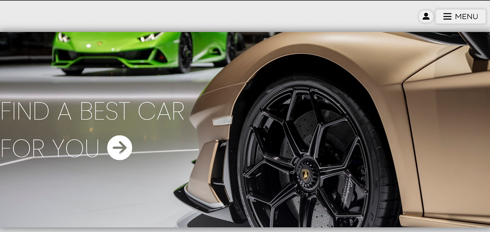
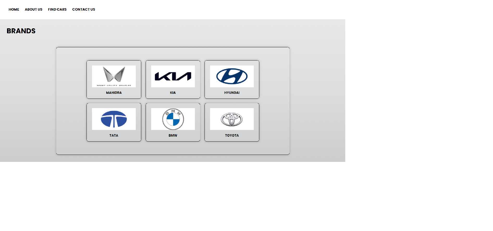
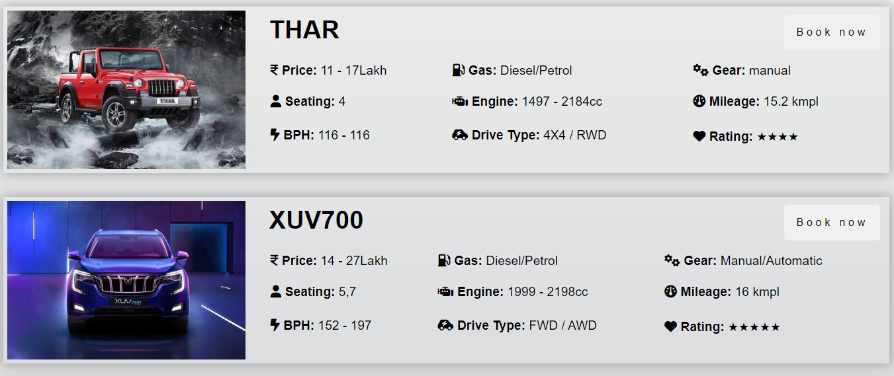
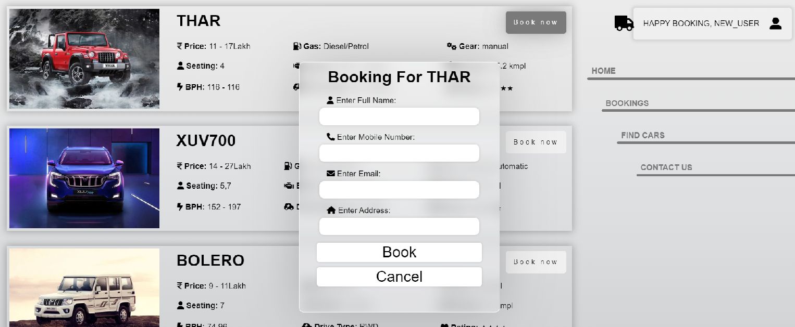
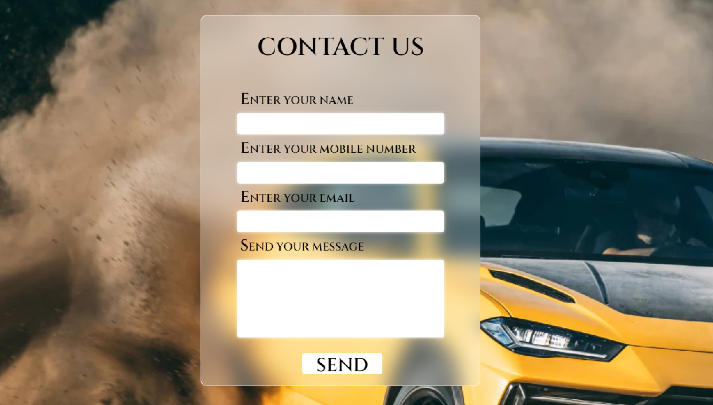

<h1 align=center>Online Car Booking</h1>

<p align=center>
    <h4 align=center>Your dream car, just a click away 🚗</h4>
</p>

##  🚀 About this project

This is a web application made to **simplify the process of car booking** for the customers. 

Equipped with a **user-friendly interface** and **multiple brands** to select from, this is the go-to website for buying your dream car.

## 🛠️ Features

- **User-friendly** interface

- **Responsive** design 

- **Multiple brands** to select from

- **Apache** and **MySQL server** ensure security and reliability

- **Quick** and **hassle free** process

- **Admin panel** to manage the website (admin only).

<details>
<summary><h2> 📚 Tech Stack</h2></summary>

- **HTML5**
- **CSS3**
- **JavaScript**
- **PHP**
- **MySQL**
- **Bootstrap**
- **XAMPP**
</details>

## 🕹️ Working demo

- Opening main.php leads to the home page with options to ***Login*** or browse the site via the ***Menu***.



- Clicking on ***Find Cars*** inside ***Menu*** leads to the page with all the available brands.



- Clicking on ***Any Brand*** (eg. Mahindra) leads to the page with all the available models of that brand.



- This list contains all the required details for each model listed next to a picture of the model.

- Clicking on ***Book Now*** in any model opens a popup to enter the details of the customer.



- **!** Note that you *need to be logged in* to book a car. (You can login by clicking on the ***profile icon on the top right corner*** of the page)

- You can contact us by clicking on ***Contact Us*** in the ***Menu*** (or) on the sidebar.



- You can also use the ***footer*** to navigate through the website, check out our social media handles and contact us.


## 📝 Usage instructions

1. Download this project and extract the zip file. (or) Clone this repository using the following command.

```bash
git clone https://github.com/PentW0lf/OnlineCarBooking.git
```

2. Download and install [XAMPP](https://www.apachefriends.org/download.html).

3. Start the Apache and MySQL server from the XAMPP control panel.

4. Open the XAMPP admin panel from [Admin panel](http://localhost/phpmyadmin) **or**
Visit the address ```http://localhost/phpmyadmin```.

5. Create a database named ```ONLINECARBOOKING``` and click on it.

6. Import the database file ```onlinecarbooking.sql``` from the project folder into the database.

7. Copy the ```onlinecarbooking``` folder from the downloaded repository folder and paste it in ```C://xampp/htdocs``` (this is for default XAMPP installation path *it may be different if you have chosen a different path during installation*).

8. Visit [Website](http://localhost/onlinecarbooking\main.php) **or** 
Open your browser and type ```http://localhost/onlinecarbooking/main.php``` in the address bar to run the website.

9. Visit [Admin panel](http://localhost/onlinecarbooking\main.php) **or** 
Type ```http://localhost/onlinecarbooking/admin.php``` in the browser.

10. **Admin credentials:**
    
    Username: ```p3ntw0lf```
    
    Password: ```p3ntw0lf@github```
